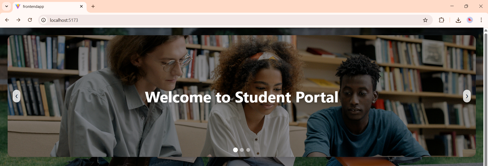
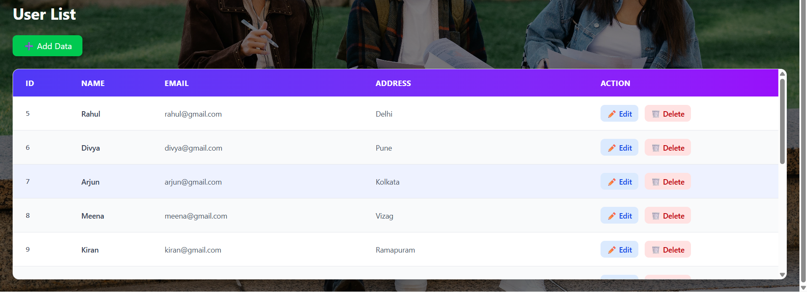

# 🎓 Student Management System

A full-stack **Student Management System** built using **React.js** (Frontend) and **Spring Boot** (Backend).  
This application allows users to perform complete **CRUD operations** (Create, Read, Update, Delete) on student records.

---

## 🚀 Features

- ➕ Add New Student
- 📋 View All Students
- ✏️ Edit Student Details
- 🗑️ Delete Student (with confirmation modal)
- 🔎 REST API Integration
- 🌐 Responsive UI Design
- 🔄 Real-Time Data Updates

---

## 🛠️ Tech Stack

### 💻 Frontend
- React.js
- Axios
- React Router DOM
- Tailwind CSS

### ⚙️ Backend
- Java
- Spring Boot
- Spring Data JPA
- REST APIs

### 🗄️ Database
- MySQL

---

## 🖼️ Application Screenshots

### 📌 Student List Page

### 📌 Add / Edit Student Page

---

## 📂 Project Structure

### 🔹 Backend (Spring Boot)
